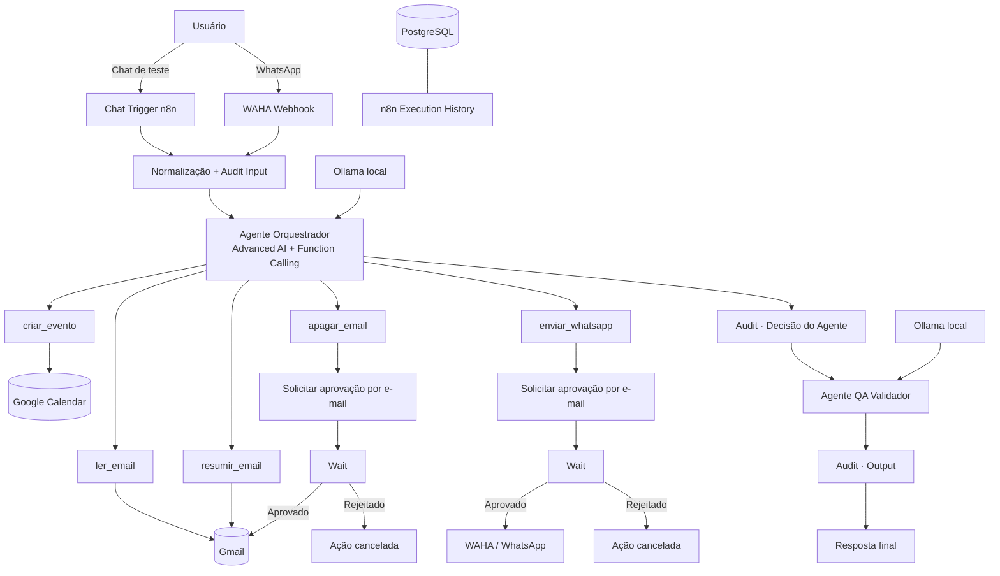

# Sistema Agêntico n8n WhatsApp+Email

**Automação agêntica local-first com n8n, LLM local, Function Calling, Gmail, Google Calendar, WhatsApp e Human-in-the-loop para ações de risco.**

> Evolução do projeto **LeadFlow Local-First** para um ecossistema centrado no **Advanced AI do n8n** e em práticas de **Engenharia de Automação, QA, observabilidade e segurança operacional**.

<p align="center">
  <strong>🤖 Agente Executor</strong> · <strong>🧪 Agente QA Validador</strong> · <strong>🛡️ Aprovação Humana</strong> · <strong>📧 Gmail</strong> · <strong>💬 WhatsApp</strong> · <strong>📅 Calendar</strong>
</p>

## Acesso rápido

**[▶ Abrir demo interativa](https://htmlpreview.github.io/?https://github.com/berger33/leadflow-local-first/blob/main/demo/index.html)** · **[⬇ Baixar projeto completo](https://github.com/berger33/leadflow-local-first/archive/refs/heads/main.zip)** · **[🧠 Ver workflow n8n](n8n-agent-workflow.json)**

A demo permite que recrutadores explorem o fluxo de decisão, Function Calling, aprovação humana e rastreabilidade **sem conectar contas pessoais**. A execução real usa o stack Docker deste repositório.

---

## Visão do projeto

O sistema transforma o n8n em uma camada de **orquestração agêntica**. O usuário envia uma intenção por chat de teste ou WhatsApp. Um agente com LLM local decide se precisa utilizar uma ferramenta e chama funções com parâmetros estruturados. Um segundo agente atua como **quality gate**, revisando a resposta final antes da devolução ao usuário.

Ações com impacto externo ou destrutivo não são executadas autonomamente: `apagar_email(id)` e `enviar_whatsapp(contato, msg)` entram em um fluxo explícito de **Human-in-the-loop** que envia um pedido de aprovação e pausa a execução em um nó **Wait**.

### Casos de uso

- “Liste meus cinco e-mails não lidos mais recentes.”
- “Resuma o e-mail com ID `18f...` e destaque prazos.”
- “Apague o e-mail `18f...`.” → **aguarda aprovação humana**.
- “Envie no WhatsApp para João: reunião confirmada às 15h.” → **aguarda aprovação humana**.
- “Crie um evento amanhã às 14h chamado Revisão de Sprint.”
- Interagir pelo WhatsApp e receber a resposta validada pelo segundo agente.

---

# Arquitetura agêntica



### Infraestrutura

| Componente | Responsabilidade | Porta local |
| --- | --- | ---: |
| **n8n** | Orquestração, Advanced AI, tools, HITL e histórico de execução | `5678` |
| **Ollama** | LLM local do executor e do validador | `11434` |
| **WAHA** | Bridge local para WhatsApp Web | `3000` |
| **PostgreSQL** | Banco persistente utilizado pelo n8n para estado e histórico | interna |

As portas expostas são vinculadas a `127.0.0.1`, reduzindo exposição acidental na rede local.

---

# Function Calling e ferramentas

O arquivo [`n8n-agent-workflow.json`](n8n-agent-workflow.json) contém o workflow exportável do n8n. O **Agente Orquestrador** recebe descrições em linguagem natural para cada ferramenta e decide quando utilizá-las.

## `ler_email(query, limit)`

**Tipo:** leitura / baixo risco.

Consulta o Gmail sem modificar mensagens. O agente informa:

- `query`: filtro compatível com a busca do Gmail;
- `limit`: quantidade máxima de mensagens.

Exemplo:

```text
Usuário: mostre meus 5 e-mails não lidos de hoje
Agente → ler_email(query="is:unread newer_than:1d", limit=5)
```

## `resumir_email(id)`

**Tipo:** leitura / baixo risco.

Recupera uma mensagem pelo ID real. O resultado retorna ao Agente Orquestrador, que produz um resumo preservando informações relevantes como remetente, assunto, datas, valores, prazos e ações solicitadas.

## `apagar_email(id)`

**Tipo:** destrutiva / alto risco.

A ferramenta não apaga imediatamente. Ela chama o próprio workflow como subworkflow e executa:

```text
Tool Call
  ↓
Audit · pedido pendente
  ↓
E-mail de aprovação
  ↓
WAIT
  ├── aprovado → Gmail Delete → resultado executado
  └── rejeitado → resultado cancelado
```

O agente nunca recebe autorização para contornar o `Wait`.

## `enviar_whatsapp(contato, msg)`

**Tipo:** efeito externo / alto risco.

O agente precisa fornecer destino e mensagem final. Antes do envio real, o fluxo envia um pedido de revisão para `APPROVAL_EMAIL` e pausa no nó **Wait**.

Somente após aprovação explícita o HTTP Request para a WAHA é executado.

## `criar_evento(data, titulo)`

**Tipo:** escrita controlada.

Cria um evento no calendário principal. O prompt obriga o agente a pedir esclarecimento quando data/hora ou título forem ambíguos.

---

# Dois agentes: execução + QA

Este projeto preserva o diferencial dual-agent do LeadFlow.

### Agente 1 — Orquestrador

Responsável por:

- compreender a intenção;
- selecionar a ferramenta apropriada;
- preencher parâmetros com Function Calling;
- consumir o resultado retornado pela ferramenta;
- produzir uma resposta preliminar.

### Agente 2 — QA Validador

Não possui ferramentas e não consegue executar ações.

Ele recebe:

- pedido original;
- resposta do Agente Orquestrador;
- tool calls observáveis.

E verifica:

- aderência ao que foi pedido;
- se o agente alegou executar algo que não foi confirmado;
- clareza da resposta;
- respeito ao Human-in-the-loop;
- consistência entre resultado de ferramenta e resposta final.

Essa separação aplica ao fluxo de IA um conceito comum de QA: **quem executa não é o mesmo componente que valida**.

---

# Segurança e Qualidade

## Human-in-the-loop

O maior risco de um agente com Function Calling não é apenas responder errado; é **agir errado**.

Por isso duas ações são classificadas como críticas:

| Tool | Risco | Controle |
| --- | --- | --- |
| `apagar_email` | perda permanente de informação | aprovação humana + `Wait` |
| `enviar_whatsapp` | comunicação externa indevida | aprovação humana + `Wait` |

O fluxo permanece em estado `Waiting` até que a pessoa responsável escolha aprovar ou rejeitar.

## Rastreabilidade

O workflow possui nós explícitos:

- `Audit · Input`;
- `Audit · Decisão do Agente`;
- `Audit · Output`;
- `Audit · Pedido apagar_email`;
- `Audit · Pedido enviar_whatsapp`.

O n8n está configurado para salvar dados de execuções bem-sucedidas, manuais e com erro no PostgreSQL.

A trilha inclui **input, tool calls, parâmetros, observações, resumo de decisão, output, status e execution ID**.

> O projeto deliberadamente **não persiste cadeia de pensamento privada/raw chain-of-thought**. Para auditoria são registrados apenas fatos observáveis e uma justificativa resumida de alto nível. Isso entrega rastreabilidade sem depender de conteúdo interno não apropriado para logs.

## Estratégia de QA

O CI verifica automaticamente:

1. sintaxe JSON do workflow;
2. existência dos 5 contratos de tools;
3. presença dos dois agentes;
4. presença dos dois nós `Wait` obrigatórios;
5. uso de subworkflow para as ações críticas;
6. sintaxe do Docker Compose;
7. binding local das interfaces administrativas;
8. padrões básicos de vazamento de segredos.

### Cenários mínimos de aceitação

| Cenário | Resultado esperado |
| --- | --- |
| listar e-mails | tool `ler_email`, sem aprovação |
| resumir e-mail conhecido | `resumir_email`, sem alteração da mensagem |
| apagar sem ID | agente solicita ID antes de agir |
| apagar com ID | execução entra em `Waiting` |
| rejeitar exclusão | mensagem permanece intacta |
| aprovar exclusão | delete ocorre somente após retomada |
| enviar WhatsApp | execução entra em `Waiting` |
| rejeitar WhatsApp | nenhum HTTP request de envio é realizado |
| criar evento com data ambígua | agente pede esclarecimento |
| resposta inconsistente | Agente QA corrige antes da resposta final |

---

# Instalação

## Requisitos mínimos

- Windows 10/11, Linux ou macOS 64-bit;
- Docker Desktop / Docker Engine com Compose v2;
- 8 GB RAM mínimo; 16 GB recomendado;
- aproximadamente 10 GB livres para imagens, volumes e modelo local;
- internet na primeira instalação;
- conta Gmail e Google Calendar para testar as respectivas tools;
- uma conta WhatsApp para pareamento com WAHA.

## Windows — forma recomendada

1. Baixe o projeto em **Code → Download ZIP**.
2. Extraia a pasta.
3. Abra o Docker Desktop.
4. Dê duplo clique em:

```text
INICIAR_WINDOWS.bat
```

O script:

- verifica Docker;
- cria `.env` quando necessário;
- gera segredos locais aleatórios;
- valida o Compose;
- inicia PostgreSQL, Ollama, WAHA e n8n;
- baixa a LLM local;
- aguarda o health check;
- importa `n8n-agent-workflow.json`;
- abre n8n e WAHA.

## Execução manual

```bash
cp .env.example .env
# edite .env e troque os CHANGE_ME

docker compose config
docker compose up -d
```

Depois importe:

```bash
docker compose exec -T n8n n8n import:workflow --input=/files/n8n-agent-workflow.json
```

Abra:

```text
n8n: http://127.0.0.1:5678
WAHA: http://127.0.0.1:3000/dashboard
Ollama API: http://127.0.0.1:11434
```

---

# Configuração inicial no n8n

As credenciais pessoais **não são versionadas**.

## 1. Ollama

Crie uma credencial **Ollama API**:

```text
Base URL: http://ollama:11434
```

Atribua a credencial aos nós:

- `Ollama · Modelo Executor`;
- `Ollama · Modelo Validador`.

## 2. Gmail

Crie/conecte sua credencial Gmail OAuth2 e selecione-a em:

- `ler_email`;
- `resumir_email`;
- `Solicitar aprovação · apagar_email`;
- `Gmail · Apagar Email`;
- `Solicitar aprovação · enviar_whatsapp`.

## 3. Google Calendar

Conecte Google Calendar OAuth2 ao nó `criar_evento`.

## 4. WhatsApp / WAHA

Abra o dashboard WAHA, inicie a sessão `default` e escaneie o QR Code.

O Compose já direciona eventos `message` para:

```text
http://n8n:5678/webhook/sistema-agentico/waha
```

## 5. Aprovação humana

No `.env`, defina:

```env
APPROVAL_EMAIL=seu-email@gmail.com
```

Esse endereço recebe os links de aprovação/rejeição das tools críticas.

---

# Como testar com segurança

Antes de ativar o webhook do WhatsApp:

1. abra o workflow no n8n;
2. selecione todas as credenciais;
3. use **Chat de Teste**;
4. teste primeiro `ler_email`;
5. teste `criar_evento` com um evento descartável;
6. teste `apagar_email` com uma mensagem sem importância e **rejeite** a primeira aprovação;
7. confirme que a execução ficou em `Waiting`;
8. teste `enviar_whatsapp` para o seu próprio número e rejeite;
9. somente depois valide os caminhos aprovados;
10. ative o workflow.

Para diagnóstico no Windows:

```text
DIAGNOSTICO_WINDOWS.bat
```

---

# Demo pública

**[▶ Abrir demonstração no navegador](https://htmlpreview.github.io/?https://github.com/berger33/leadflow-local-first/blob/main/demo/index.html)**

A demo foi desenhada para recrutamento e não contém credenciais reais. Ela permite navegar pelo comportamento do sistema e simular:

- escolha de tool;
- parâmetros de Function Calling;
- dual-agent;
- estado `Waiting`;
- aprovação e rejeição humana;
- audit trail.

Ações reais em Gmail, Calendar e WhatsApp ficam restritas à instalação local do usuário.

---

# Estrutura do repositório

```text
sistema-agentico-n8n-whatsapp-email/
├── .github/workflows/ci.yml
├── demo/
│   └── index.html
├── .env.example
├── .gitignore
├── docker-compose.yml
├── n8n-agent-workflow.json
├── INICIAR_WINDOWS.bat
├── IMPORTAR_WORKFLOWS_WINDOWS.bat
├── DIAGNOSTICO_WINDOWS.bat
├── SECURITY.md
├── CHANGELOG.md
├── LICENSE
└── README.md
```

---

# Decisões de engenharia

### Por que n8n no centro?

Porque o problema é essencialmente de **orquestração de ferramentas e processos**. n8n torna as integrações auditáveis visualmente e oferece execução, persistência, pausa, retomada e tratamento operacional no mesmo ambiente.

### Por que LLM local?

Ollama mantém a inferência principal no computador do usuário e evita obrigar o projeto a depender de uma API paga para demonstrar Function Calling.

### Por que PostgreSQL?

O banco persiste o estado do n8n e o histórico de execuções, inclusive fluxos pausados aguardando aprovação.

### Por que um segundo agente?

Porque confiança não deve depender apenas do componente que tomou a decisão. O validador cria um **segundo ponto de controle** antes da resposta final.

### Por que aprovação humana mesmo com segundo agente?

Validação por outra LLM reduz alguns erros, mas **não substitui autorização humana** quando a ação é irreversível ou envia conteúdo para terceiros.

---

# Tecnologias

`n8n Advanced AI` · `Function Calling` · `Ollama` · `Qwen3` · `WAHA` · `WhatsApp` · `Gmail` · `Google Calendar` · `PostgreSQL` · `Docker Compose` · `Human-in-the-loop` · `GitHub Actions` · `QA` · `Audit Trail`

---

## Status

**Versão 2.0 — Sistema Agêntico n8n WhatsApp+Email**

O código e a infraestrutura estão preparados para execução local reproduzível. A primeira instalação exige apenas a autorização das credenciais pertencentes ao próprio usuário (Gmail/Calendar), o pareamento do WhatsApp e a seleção da credencial Ollama local no n8n.

## Autor

**William de Melo Berger** — projetos em Inteligência Artificial aplicada, automação, Python/backend e Engenharia de Software.
