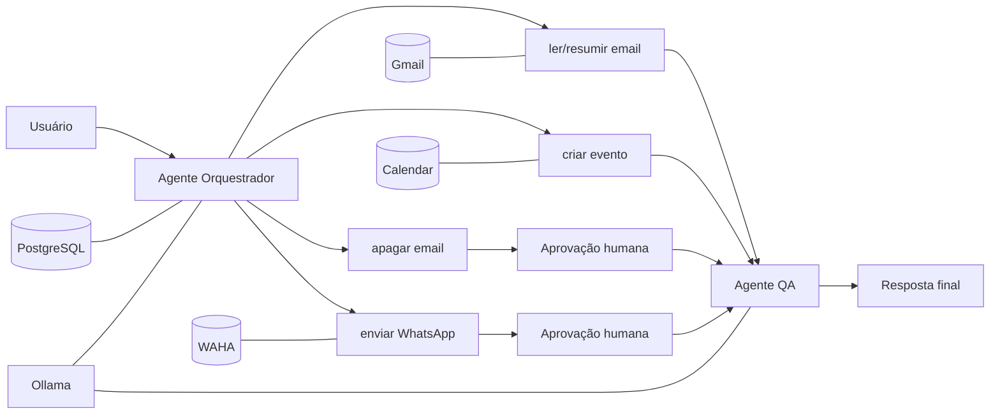

# LeadFlow Local First

**Automação local com n8n + Ollama para Gmail, Google Calendar e WhatsApp, com aprovação humana em ações sensíveis e validação independente da resposta.**

[](https://github.com/berger33/leadflow-local-first/actions/workflows/ci.yml)

[Demo interativa](https://htmlpreview.github.io/?https://github.com/berger33/leadflow-local-first/blob/main/demo/index.html) · [Workflow](n8n-agent-workflow.json) · [Segurança](SECURITY.md) · [Instalação detalhada](docs/INSTALLATION.md) · [Cenários de comportamento](evals/behavior_cases.json)

## Problema

Queria testar uma automação pessoal que pudesse **ler informação real, escolher ferramentas e executar ações externas sem transformar o LLM em uma autoridade irrestrita**. O sistema roda localmente, usa modelos via Ollama e separa leitura, execução, aprovação e validação.

## Arquitetura



## Evidências para avaliação técnica

| Afirmação | Onde verificar |
|---|---|
| 5 contratos de ferramentas | [`n8n-agent-workflow.json`](n8n-agent-workflow.json) |
| gates para exclusão de email e envio de WhatsApp | [`n8n-agent-workflow.json`](n8n-agent-workflow.json) |
| segundo agente sem responsabilidade de execução | [`n8n-agent-workflow.json`](n8n-agent-workflow.json) |
| tratamento de segredos e superfícies locais | [`SECURITY.md`](SECURITY.md) |
| bootstrap reproduzível | [`scripts/bootstrap.ps1`](scripts/bootstrap.ps1) |
| instalador local | [`scripts/setup-wizard-v2.ps1`](scripts/setup-wizard-v2.ps1) |
| infraestrutura | [`docker-compose.yml`](docker-compose.yml) |
| cenários de comportamento esperados | [`evals/behavior_cases.json`](evals/behavior_cases.json) |
| validação automática dos cenários | [`scripts/validate_behavior_cases.py`](scripts/validate_behavior_cases.py) |
| CI + smoke test real | [`.github/workflows/ci.yml`](.github/workflows/ci.yml) |

## Comportamento esperado

| Pedido | Ferramenta | Aprovação humana |
|---|---|---|
| buscar emails | `ler_email` | não |
| resumir um email real | `resumir_email` | não |
| criar evento | `criar_evento` | não, quando parâmetros estão claros |
| apagar email | `apagar_email` | **sim** |
| enviar WhatsApp | `enviar_whatsapp` | **sim** |

Os casos completos ficam em `evals/behavior_cases.json`. Eles existem para que o portfólio não dependa apenas da presença visual de nós no workflow: cada capability declarada possui ferramenta, criticidade e gate esperado versionados.

## Qualidade

O CI não se limita a validar JSON. Ele verifica contratos do workflow, scripts PowerShell, configuração Docker, padrões de segredos e UTF-8 do instalador. Em um job separado, sobe **PostgreSQL, Ollama, n8n e WAHA**, baixa um modelo Ollama real, cria o primeiro usuário local do n8n, finaliza o bootstrap e confirma que o workflow foi importado.

```text
checkout
  ↓
contratos + scripts + Docker + security checks
  ↓
behavior cases
  ↓
subir stack real
  ↓
ollama pull
  ↓
criar owner n8n
  ↓
finalizar bootstrap
  ↓
verificar workflow + WAHA
```

## Instalação rápida no Windows

Pré-requisito: Docker Desktop.

```text
INSTALAR_WINDOWS.bat
```

O assistente local coleta somente informações necessárias ao proprietário, gera segredos internos e prepara o stack. Consentimentos de identidade continuam manuais: OAuth do Google e QR Code do WhatsApp.

Detalhes, requisitos e troubleshooting: [`docs/INSTALLATION.md`](docs/INSTALLATION.md).

## Segurança operacional

- serviços administrativos ligados a `127.0.0.1`;
- segredos locais fora do Git;
- senha do proprietário não persistida pelo instalador;
- arquivos temporários removidos após importação;
- exclusão de email e envio de mensagem exigem aprovação humana;
- QA recebe evidências observáveis e não deve inventar sucesso;
- chain-of-thought não é armazenado como requisito do sistema.

Detalhes: [`SECURITY.md`](SECURITY.md).

## Stack

`n8n` · `Ollama` · `PostgreSQL` · `Docker Compose` · `PowerShell` · `WAHA` · `Gmail` · `Google Calendar` · `GitHub Actions`

## Uso de IA no desenvolvimento

Ferramentas de IA são usadas para acelerar implementação, testes e documentação. A evidência que apresento como portfólio é o que pode ser auditado: contratos, cenários, CI, comportamento esperado, segurança e código/configuração versionados. O objetivo não é esconder assistência por IA, e sim demonstrar **ownership técnico sobre o resultado**.

## Status

**v2.2.1** — stack local, guided setup e CI do fluxo de primeira instalação.
