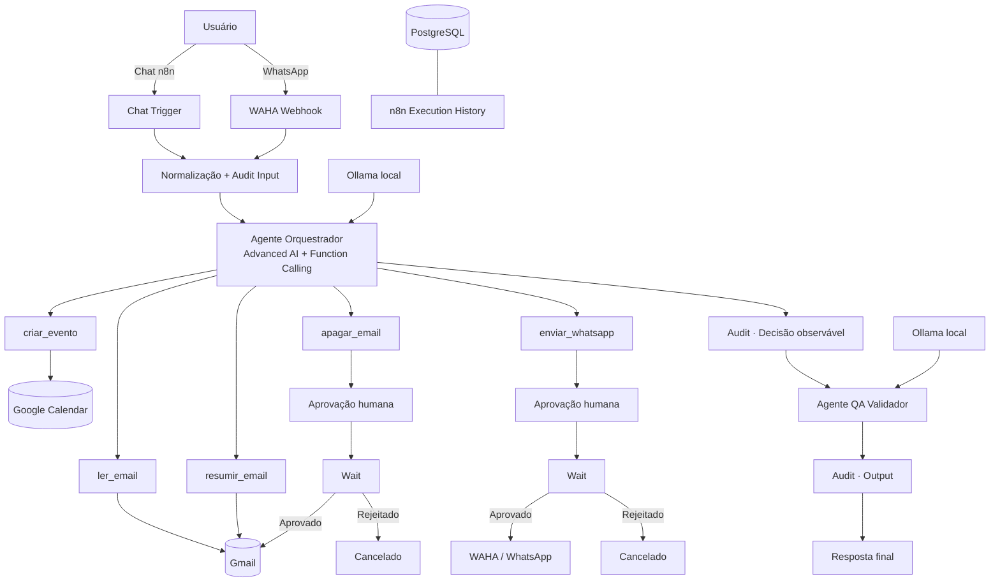

# Sistema Agêntico n8n WhatsApp+Email

**Automação agêntica local-first com n8n, LLM local, Function Calling, Gmail, Google Calendar, WhatsApp, Human-in-the-loop e um segundo agente de QA.**

[](https://github.com/berger33/leadflow-local-first/actions/workflows/ci.yml)

> Evolução do LeadFlow para um sistema centrado em orquestração agêntica, segurança operacional, QA e uma experiência de instalação orientada a produto.

<p align="center">
  <strong>🤖 Agente Executor</strong> · <strong>🧪 Agente QA</strong> · <strong>🛡️ Human-in-the-loop</strong> · <strong>📧 Gmail</strong> · <strong>💬 WhatsApp</strong> · <strong>📅 Calendar</strong>
</p>

## Acesso rápido

**[▶ Abrir demo interativa](https://htmlpreview.github.io/?https://github.com/berger33/leadflow-local-first/blob/main/demo/index.html)** · **[⬇ Baixar projeto](https://github.com/berger33/leadflow-local-first/archive/refs/heads/main.zip)** · **[🧠 Ver workflow](n8n-agent-workflow.json)**

A demo pública permite entender Function Calling, dual-agent, aprovação humana e audit trail sem conectar contas pessoais. A versão completa roda localmente.

---

# Instalação visual no Windows

A experiência recomendada foi desenhada para que um novo usuário **não precise editar `.env`, criar chaves internas nem importar o workflow manualmente**.

## Requisitos

- Windows 10/11 64-bit;
- Docker Desktop com Docker Compose v2;
- 8 GB RAM mínimo; 16 GB recomendado;
- aproximadamente 10 GB livres;
- internet na primeira instalação.

Você **não precisa instalar manualmente** Python, Node.js, PostgreSQL, n8n, Ollama ou WAHA.

## Primeira execução

1. Baixe o ZIP do projeto.
2. Extraia a pasta.
3. Abra o Docker Desktop e aguarde o Engine ficar pronto.
4. Execute:

```text
INSTALAR_WINDOWS.bat
```

ou simplesmente:

```text
INICIAR_WINDOWS.bat
```

Se a instalação ainda não estiver concluída, `INICIAR_WINDOWS.bat` detecta a primeira execução e abre automaticamente o assistente visual.

## Uma única tela de configuração

O navegador abre localmente em:

```text
http://127.0.0.1:8765
```

Antes de instalar, o usuário informa em uma única tela:

### Acesso local do n8n

- nome;
- sobrenome;
- e-mail de login;
- senha local.

A senha fica apenas em memória durante a instalação. Ela **não é escrita no `.env` nem em arquivo temporário**.

Quando o n8n sobe pela primeira vez, o assistente utiliza o endpoint local de setup da própria instância para criar o proprietário automaticamente.

### Preferências do agente

- e-mail para aprovações Human-in-the-loop;
- modelo Ollama do Agente Executor;
- modelo Ollama do Agente QA;
- fuso horário.

### Google OAuth2 — opcional durante a instalação

A mesma tela aceita:

- Google OAuth Client ID;
- Google OAuth Client Secret.

Ela mostra a URI de redirecionamento que deve ser cadastrada no Google Cloud:

```text
http://localhost:5678/rest/oauth2-credential/callback
```

Se Client ID e Client Secret forem fornecidos, o sistema prepara automaticamente as credenciais Gmail e Calendar e as referencia nos respectivos nós. Depois resta apenas o **consentimento OAuth no navegador**, que obrigatoriamente pertence ao usuário da conta Google.

---

# O que acontece ao clicar em “Instalar e configurar automaticamente”

```text
valida o formulário
      ↓
verifica Docker
      ↓
cria/repara .env
      ↓
gera segredos internos aleatórios
      ↓
valida Docker Compose
      ↓
remove conflitos de versões antigas
      ↓
inicia PostgreSQL + Ollama
      ↓
executa health checks
      ↓
verifica o modelo escolhido
      ↓
baixa com retry se necessário
      ↓
inicia n8n + WAHA
      ↓
executa novos health checks
      ↓
cria o proprietário local do n8n
      ↓
cria a credencial Ollama
      ↓
prepara Gmail/Calendar se informado
      ↓
gera uma cópia temporária do workflow com as referências
      ↓
importa e verifica o workflow
      ↓
apaga os arquivos temporários
      ↓
marca a instalação como concluída
```

Durante o processo, a interface exibe cards de status para Docker, PostgreSQL, Ollama, n8n, WAHA e workflow, barra de progresso e detalhes técnicos para diagnóstico.

---

# Depois da instalação

## Ollama

A conexão é automática.

O bootstrap cria no n8n a credencial:

```text
Ollama Local - Sistema Agentico
```

com:

```text
Base URL: http://ollama:11434
```

Ela é associada automaticamente aos dois modelos do workflow.

A instalação local padrão não exige API key de IA.

## Gmail + Google Calendar

Se as chaves Google foram preenchidas no assistente, as credenciais já estarão preparadas e vinculadas.

O usuário faz login no n8n com o acesso criado durante a instalação e conclui o consentimento Google em **Credentials**.

Se preferir não fornecer Client ID/Secret na instalação, Gmail e Calendar podem ser configurados depois sem impedir a instalação do núcleo.

## WhatsApp / WAHA

O sistema gera automaticamente:

- API key local;
- usuário do dashboard;
- senha forte aleatória;
- webhook apontando para o n8n;
- sessão padrão `default`.

Na etapa **Conexões**, a interface exibe usuário e senha com ações de copiar/revelar.

O único passo obrigatório é abrir o WAHA e **escanear o QR Code do próprio WhatsApp**, pois isso representa consentimento da conta real.

## Próximas execuções

Depois da instalação, é criado localmente:

```text
.setup-complete
```

Nas próximas vezes:

```text
INICIAR_WINDOWS.bat
```

apenas inicia o stack existente e verifica os serviços. O wizard não reaparece desnecessariamente.

---

# Automação x consentimento

| Etapa | Tratamento |
| --- | --- |
| PostgreSQL | ✅ automático |
| Chave de criptografia do n8n | ✅ automática |
| API key e senha do WAHA | ✅ automáticas |
| Ollama | ✅ automático |
| Download/validação do modelo | ✅ automático |
| Primeiro proprietário do n8n | ✅ criado pela UI com os dados escolhidos pelo usuário |
| Credencial Ollama no n8n | ✅ automática |
| Importação e verificação do workflow | ✅ automática |
| Gmail/Calendar com Client ID/Secret fornecidos | ✅ credenciais preparadas automaticamente |
| Consentimento Google OAuth | 👤 usuário autoriza no Google |
| Pareamento WhatsApp | 👤 usuário escaneia o QR Code |

A filosofia é: **automatizar toda configuração técnica que pode ser reproduzida; preservar intervenção humana onde existe identidade, consentimento ou efeito externo.**

---

# Arquitetura agêntica



---

# Function Calling

O arquivo [`n8n-agent-workflow.json`](n8n-agent-workflow.json) contém o workflow base exportável.

## `ler_email(query, limit)`

Leitura de mensagens do Gmail, sem alteração do conteúdo.

## `resumir_email(id)`

Recupera um e-mail real pelo ID para que o agente produza um resumo estruturado.

## `apagar_email(id)`

Ação destrutiva. Nunca executa imediatamente.

```text
Tool Call
  ↓
Audit
  ↓
Pedido de aprovação
  ↓
Wait
  ├── aprovado → Gmail Delete
  └── rejeitado → cancelamento
```

## `enviar_whatsapp(contato, msg)`

Ação de efeito externo. Também exige aprovação humana antes do HTTP Request para WAHA.

## `criar_evento(data, titulo)`

Cria evento no Google Calendar somente quando data/hora e título estão claros.

---

# Dois agentes

## Agente Executor

Responsável por:

- compreender intenção;
- decidir se precisa de ferramenta;
- preencher parâmetros via Function Calling;
- consumir resultados;
- gerar resposta preliminar.

## Agente QA Validador

Não possui ferramentas destrutivas.

Recebe:

- pedido original;
- resposta preliminar;
- tool calls observáveis.

E verifica:

- aderência ao pedido;
- clareza;
- consistência com resultados de ferramentas;
- ausência de sucesso inventado;
- respeito ao Human-in-the-loop.

A regra de projeto é: **quem executa não é o mesmo componente que valida**.

---

# Segurança e privacidade

- portas administrativas vinculadas a `127.0.0.1`;
- setup UI vinculada somente a `127.0.0.1:8765`;
- `.env` ignorado pelo Git;
- senha do proprietário n8n mantida somente em memória durante o setup;
- arquivos temporários de credenciais ignorados pelo Git e removidos após a importação;
- segredos internos gerados localmente;
- tokens OAuth não são versionados;
- sessão do WhatsApp permanece local;
- ações sensíveis possuem `Wait` + aprovação humana;
- audit trail registra input, ferramentas, parâmetros, resultados e output;
- raw chain-of-thought não é persistido;
- cabeçalhos de segurança básicos são enviados pela UI local.

Consulte também [`SECURITY.md`](SECURITY.md) e [`docs/CREDENTIALS_SETUP.md`](docs/CREDENTIALS_SETUP.md).

---

# Qualidade e CI

O GitHub Actions valida estaticamente:

- JSON do workflow;
- dois agentes;
- cinco tools;
- dois gates Human-in-the-loop;
- estrutura e IDs obrigatórios do instalador visual;
- sintaxe de `bootstrap.ps1` e `setup-wizard.ps1`;
- fases `Prepare`, `Finalize` e `Start`;
- contratos de importação de credenciais/workflow;
- Docker Compose;
- bind local das portas;
- ausência do antigo `ollama-init`;
- padrões comuns de vazamento de segredo.

O smoke test Docker sobe PostgreSQL, Ollama, n8n e WAHA e também executa:

1. `ollama pull` real de um modelo pequeno;
2. `ollama show`;
3. validação do estado de primeira execução do n8n;
4. criação de um proprietário de teste pelo endpoint local de setup;
5. execução real da fase `Finalize` do bootstrap;
6. importação de credencial Ollama;
7. importação do workflow;
8. verificação do workflow pelo CLI;
9. confirmação de que arquivos temporários foram removidos.

Assim o CI testa o mesmo caminho crítico usado pelo instalador, e não somente sintaxe de YAML/JSON.

---

# Diagnóstico

Se algo falhar no Windows:

```text
DIAGNOSTICO_WINDOWS.bat
```

O script verifica Docker, Compose, containers, endpoints e logs dos serviços.

---

# Execução manual

Para quem prefere controlar tudo pelo terminal:

```bash
cp .env.example .env
# edite somente o necessário

docker compose config
docker compose up -d
```

O bootstrap pode ser executado em fases:

```powershell
powershell -ExecutionPolicy Bypass -File scripts/bootstrap.ps1 -Mode Prepare
powershell -ExecutionPolicy Bypass -File scripts/bootstrap.ps1 -Mode Finalize
powershell -ExecutionPolicy Bypass -File scripts/bootstrap.ps1 -Mode Start
```

---

# Estrutura principal

```text
leadflow-local-first/
├── .github/workflows/ci.yml
├── demo/
│   └── index.html
├── setup/
│   └── index.html
├── scripts/
│   ├── bootstrap.ps1
│   └── setup-wizard.ps1
├── .env.example
├── docker-compose.yml
├── n8n-agent-workflow.json
├── INSTALAR_WINDOWS.bat
├── INICIAR_WINDOWS.bat
├── DIAGNOSTICO_WINDOWS.bat
├── SECURITY.md
├── CHANGELOG.md
└── README.md
```

---

# Tecnologias

`n8n Advanced AI` · `Function Calling` · `Ollama` · `Qwen3` · `WAHA` · `WhatsApp` · `Gmail` · `Google Calendar` · `PostgreSQL` · `Docker Compose` · `PowerShell` · `Human-in-the-loop` · `GitHub Actions` · `QA` · `Audit Trail`

---

## Status

**Versão 2.2 — Guided Setup**

O projeto possui instalação visual local em uma única tela, bootstrap autorreparável, criação assistida do proprietário n8n, LLM e credencial Ollama automáticas, preparação opcional de Gmail/Calendar e uma fronteira explícita entre automação técnica e consentimento de contas pessoais.

## Autor

**William de Melo Berger** — projetos em Inteligência Artificial aplicada, automação, backend e Engenharia de Software.
