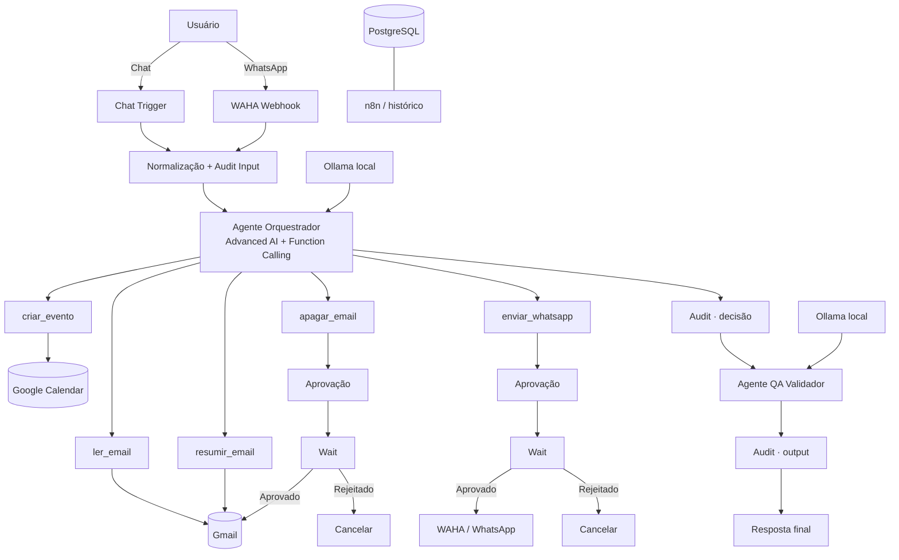

# Sistema Agêntico n8n WhatsApp+Email

**Automação agêntica local-first com n8n, LLM local, Function Calling, Gmail, Google Calendar, WhatsApp, Human-in-the-loop e um segundo agente de QA.**

[](https://github.com/berger33/leadflow-local-first/actions/workflows/ci.yml)

> Evolução do projeto **LeadFlow Local-First** para um ecossistema centrado no Advanced AI do n8n, automação segura e qualidade de software.

<p align="center">
  <strong>🤖 Agente Executor</strong> · <strong>🧪 Agente QA</strong> · <strong>🛡️ Aprovação Humana</strong> · <strong>📧 Gmail</strong> · <strong>💬 WhatsApp</strong> · <strong>📅 Calendar</strong>
</p>

## Acesso rápido

**[▶ Abrir demo interativa](https://htmlpreview.github.io/?https://github.com/berger33/leadflow-local-first/blob/main/demo/index.html)** · **[⬇ Baixar projeto completo](https://github.com/berger33/leadflow-local-first/archive/refs/heads/main.zip)** · **[🧠 Ver workflow n8n](n8n-agent-workflow.json)**

A demo permite explorar Function Calling, dual-agent, aprovação humana e audit trail sem conectar contas pessoais. A execução real roda localmente via Docker.

---

# Instalação no Windows — recomendada

## Requisitos mínimos

- Windows 10/11 64-bit;
- Docker Desktop com Docker Compose v2;
- 8 GB de RAM no mínimo; 16 GB recomendado;
- cerca de 10 GB livres para imagens, volumes e modelo local;
- internet na primeira instalação.

Você **não precisa instalar manualmente** Python, Node.js, n8n, PostgreSQL, Ollama ou WAHA.

## Primeira execução

1. Baixe o ZIP do projeto.
2. Extraia a pasta.
3. Abra o Docker Desktop e aguarde o Engine ficar pronto.
4. Dê duplo clique em:

```text
INICIAR_WINDOWS.bat
```

O instalador chama `scripts/bootstrap.ps1`, que executa automaticamente:

```text
Docker disponível?
      ↓
cria/repara .env
      ↓
gera senhas e chaves locais aleatórias
      ↓
valida docker-compose.yml
      ↓
remove containers legados que possam conflitar
      ↓
inicia PostgreSQL + Ollama
      ↓
health checks reais
      ↓
modelo já existe?
   ├── sim → continua
   └── não → download com até 3 tentativas
      ↓
inicia n8n + WAHA
      ↓
aguarda n8n responder
      ↓
workflow já existe?
   ├── sim → não duplica
   └── não → importa automaticamente
      ↓
abre n8n + WAHA
```

### O que o instalador pergunta

Senhas internas de banco, WAHA e chave de criptografia do n8n são **geradas automaticamente** e salvas apenas no `.env` local.

Para o Human-in-the-loop, o bootstrap solicita:

```text
E-mail que receberá pedidos de aprovação
```

Você pode pressionar `ENTER` e configurar depois se ainda estiver testando apenas ações não destrutivas.

### O que não pode ser automatizado sem sua autorização

Algumas etapas dependem da identidade do próprio usuário e, por segurança, não são incluídas no GitHub:

1. criar o administrador local do n8n na primeira abertura;
2. criar no n8n a credencial Ollama apontando para `http://ollama:11434` e atribuí-la aos dois modelos;
3. autorizar Gmail e Google Calendar via OAuth2;
4. escanear o QR Code do WhatsApp no WAHA.

Essas etapas não são “falhas do instalador”: OAuth e QR Code são consentimentos vinculados às contas reais de quem está executando o projeto.

---

# Correção do erro `ollama-init`

Versões anteriores utilizavam um container temporário chamado `ollama-init` e faziam o n8n depender da conclusão desse container.

Em algumas instalações do Docker Desktop, uma falha ou recriação desse serviço podia produzir mensagens como:

```text
service "ollama-init" didn't complete successfully
No such container
service "n8n" is not running
```

A arquitetura atual **não utiliza mais `ollama-init`**.

Agora:

- Ollama é um serviço permanente;
- o bootstrap aguarda a API real responder;
- verifica se o modelo já existe;
- baixa o modelo diretamente no container permanente;
- repete o download em caso de falha transitória;
- n8n não depende de um container descartável;
- containers legados conhecidos são removidos automaticamente sem apagar os volumes persistentes.

Se você veio de uma versão anterior, basta baixar a versão atual e executar novamente `INICIAR_WINDOWS.bat`.

Para diagnóstico detalhado:

```text
DIAGNOSTICO_WINDOWS.bat
```

Ele mostra containers, possíveis conflitos legados, health checks, modelos Ollama e logs de PostgreSQL, Ollama, n8n e WAHA.

---

# Visão do projeto

O sistema transforma o n8n em uma camada de **orquestração agêntica**. O usuário envia uma intenção por chat de teste ou WhatsApp. Um agente com LLM local decide se precisa utilizar uma ferramenta e realiza Function Calling com parâmetros estruturados.

Um segundo agente atua como **quality gate** e revisa a resposta antes da devolução ao usuário.

Ações com impacto externo ou destrutivo não são executadas autonomamente: `apagar_email(id)` e `enviar_whatsapp(contato, msg)` entram obrigatoriamente em Human-in-the-loop.

### Exemplos

- “Liste meus cinco e-mails não lidos mais recentes.”
- “Resuma o e-mail com ID `18f...` e destaque prazos.”
- “Apague o e-mail `18f...`.” → **aguarda aprovação humana**.
- “Envie no WhatsApp para João: reunião confirmada às 15h.” → **aguarda aprovação humana**.
- “Crie um evento amanhã às 14h chamado Revisão de Sprint.”

---

# Arquitetura



| Componente | Responsabilidade | Porta local |
| --- | --- | ---: |
| **n8n** | Advanced AI, tools, HITL, workflows e histórico | `5678` |
| **Ollama** | LLM local do executor e validador | `11434` |
| **WAHA** | integração com WhatsApp Web | `3000` |
| **PostgreSQL** | persistência do n8n e execuções | interna |

As portas administrativas expostas são vinculadas a `127.0.0.1`.

---

# Function Calling

O arquivo [`n8n-agent-workflow.json`](n8n-agent-workflow.json) contém o workflow importável.

## `ler_email(query, limit)`

Consulta mensagens do Gmail sem modificá-las. É uma tool de leitura e baixo risco.

```text
Usuário: mostre meus 5 e-mails não lidos de hoje
Agente → ler_email(query="is:unread newer_than:1d", limit=5)
```

## `resumir_email(id)`

Recupera uma mensagem pelo ID real e fornece contexto ao agente para produzir um resumo com remetente, assunto, datas, valores, prazos e ações solicitadas.

## `apagar_email(id)`

Ação destrutiva. Não apaga imediatamente:

```text
Tool Call
  ↓
Audit
  ↓
E-mail de aprovação
  ↓
WAIT
  ├── aprovado → Gmail Delete
  └── rejeitado → ação cancelada
```

## `enviar_whatsapp(contato, msg)`

Ação com efeito externo. O destino e o texto são preparados pelo agente, porém a WAHA só recebe a chamada depois da aprovação humana.

## `criar_evento(data, titulo)`

Cria um evento no calendário principal. O agente deve solicitar esclarecimento quando data, horário ou título forem ambíguos.

---

# Dois agentes: execução + QA

### Agente Orquestrador

Responsável por compreender a intenção, escolher ferramentas, preencher parâmetros de Function Calling e produzir a resposta preliminar.

### Agente QA Validador

Não possui tools destrutivas. Recebe pedido original, resposta preliminar e tool calls observáveis para verificar:

- aderência ao pedido;
- clareza;
- consistência com resultados reais;
- ausência de alegações de execução não confirmadas;
- respeito ao Human-in-the-loop.

A ideia de projeto é simples: **quem executa não é o mesmo componente que valida**.

---

# Segurança e qualidade

## Human-in-the-loop

| Tool | Risco | Controle |
| --- | --- | --- |
| `apagar_email` | perda de informação | aprovação humana + `Wait` |
| `enviar_whatsapp` | comunicação externa indevida | aprovação humana + `Wait` |

## Audit trail

O workflow registra nós explícitos para:

- input;
- decisão observável do agente;
- output;
- pedido de exclusão;
- pedido de envio de WhatsApp.

A trilha registra fatos observáveis, parâmetros e resultados. **Não persiste raw chain-of-thought privado.**

## CI

O GitHub Actions executa duas camadas.

### Validação estática

- JSON do workflow;
- existência dos 5 contratos de tools;
- dois agentes;
- dois gates `Wait`;
- sintaxe do Compose;
- sintaxe do bootstrap PowerShell;
- binding localhost;
- regressões básicas de segredo;
- garantia de que `ollama-init` não volte ao Compose.

### Smoke test Docker real

O CI também sobe de verdade:

```text
PostgreSQL + Ollama + n8n
```

Depois aguarda e verifica:

- API do Ollama;
- `ollama list` dentro do container;
- `/healthz` do n8n;
- estado final do Compose.

Isso reduz o risco de um arquivo sintaticamente válido quebrar apenas no primeiro boot.

---

# Configuração das credenciais no n8n

## Ollama

Crie uma credencial **Ollama API**:

```text
Base URL: http://ollama:11434
```

Associe a:

- `Ollama · Modelo Executor`;
- `Ollama · Modelo Validador`.

## Gmail

Conecte Gmail OAuth2 a:

- `ler_email`;
- `resumir_email`;
- `Solicitar aprovação · apagar_email`;
- `Gmail · Apagar Email`;
- `Solicitar aprovação · enviar_whatsapp`.

## Google Calendar

Conecte Google Calendar OAuth2 ao nó `criar_evento`.

## WhatsApp

Abra:

```text
http://127.0.0.1:3000/dashboard
```

Inicie/abra a sessão `default` e escaneie o QR Code.

O webhook configurado é:

```text
http://n8n:5678/webhook/sistema-agentico/waha
```

---

# Como testar com segurança

Antes de ativar o workflow em produção local:

1. configure as credenciais;
2. use o Chat de Teste;
3. teste `ler_email`;
4. teste `resumir_email`;
5. crie um evento descartável;
6. solicite exclusão de um e-mail sem importância e **rejeite primeiro**;
7. confirme o estado `Waiting`;
8. teste WhatsApp para o próprio número e rejeite primeiro;
9. valide depois os caminhos aprovados;
10. só então ative o webhook.

O plano completo de QA está em [`docs/QA_TEST_PLAN.md`](docs/QA_TEST_PLAN.md).

---

# Execução manual

Para quem prefere não usar o bootstrap:

```bash
cp .env.example .env
# troque os CHANGE_ME

docker compose config
docker compose up -d postgres ollama

docker compose exec -T ollama ollama pull qwen3:4b

docker compose up -d n8n waha

docker compose exec -T n8n n8n import:workflow --input=/files/n8n-agent-workflow.json
```

Acesse:

```text
n8n:       http://127.0.0.1:5678
WAHA:      http://127.0.0.1:3000/dashboard
Ollama API:http://127.0.0.1:11434
```

---

# Demo pública

**[▶ Abrir demonstração no navegador](https://htmlpreview.github.io/?https://github.com/berger33/leadflow-local-first/blob/main/demo/index.html)**

A demo usa dados simulados e permite experimentar escolha de tool, parâmetros de Function Calling, dual-agent, estado `Waiting`, aprovação/rejeição e audit trail sem acessar Gmail, Calendar ou WhatsApp de terceiros.

---

# Estrutura

```text
sistema-agentico-n8n-whatsapp-email/
├── .github/workflows/ci.yml
├── demo/
│   └── index.html
├── docs/
│   ├── CREDENTIALS_SETUP.md
│   └── QA_TEST_PLAN.md
├── scripts/
│   └── bootstrap.ps1
├── .env.example
├── .gitignore
├── docker-compose.yml
├── n8n-agent-workflow.json
├── INICIAR_WINDOWS.bat
├── IMPORTAR_WORKFLOWS_WINDOWS.bat
├── DIAGNOSTICO_WINDOWS.bat
├── SECURITY.md
├── CHANGELOG.md
├── LICENSE
└── README.md
```

---

# Decisões de engenharia

**Por que n8n no centro?** O problema é de orquestração, integrações, pausa/retomada e auditabilidade visual.

**Por que Ollama?** Mantém a inferência principal local e evita uma API paga obrigatória para o agente.

**Por que PostgreSQL?** Persiste estado, histórico e execuções pausadas aguardando aprovação.

**Por que segundo agente?** O componente que toma uma decisão não deve ser o único responsável por validar sua própria saída.

**Por que aprovação humana mesmo com QA?** Outra LLM pode reduzir erros, mas não substitui autorização para ações irreversíveis ou comunicação com terceiros.

---

# Tecnologias

`n8n Advanced AI` · `Function Calling` · `Ollama` · `Qwen3` · `WAHA` · `WhatsApp` · `Gmail` · `Google Calendar` · `PostgreSQL` · `Docker Compose` · `PowerShell` · `Human-in-the-loop` · `GitHub Actions` · `QA` · `Audit Trail`

---

## Status

**Versão 2.1 — bootstrap autorreparável**

A infraestrutura local é preparada automaticamente. Integrações que representam identidade do usuário continuam exigindo OAuth/QR Code por segurança.

## Autor

**William de Melo Berger** — projetos em Inteligência Artificial aplicada, automação, Python/backend e Engenharia de Software.
