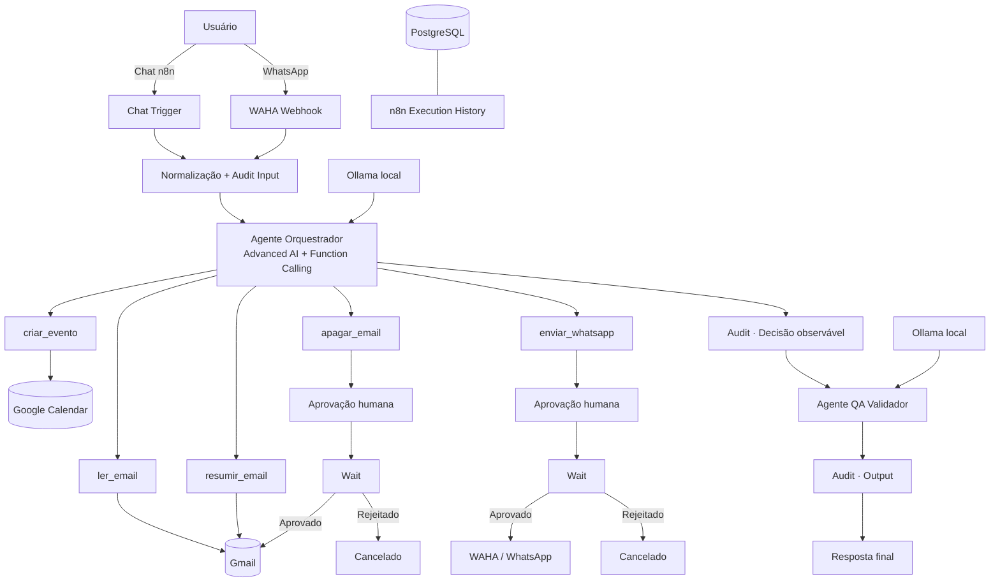

# Sistema Agêntico n8n WhatsApp+Email

**Automação agêntica local-first com n8n, LLM local, Function Calling, Gmail, Google Calendar, WhatsApp, Human-in-the-loop e um segundo agente de QA.**

[](https://github.com/berger33/leadflow-local-first/actions/workflows/ci.yml)

> Evolução do LeadFlow para um sistema centrado em orquestração agêntica, segurança operacional, QA e experiência de instalação reproduzível.

<p align="center">
  <strong>🤖 Agente Executor</strong> · <strong>🧪 Agente QA</strong> · <strong>🛡️ Human-in-the-loop</strong> · <strong>📧 Gmail</strong> · <strong>💬 WhatsApp</strong> · <strong>📅 Calendar</strong>
</p>

## Acesso rápido

**[▶ Abrir demo interativa](https://htmlpreview.github.io/?https://github.com/berger33/leadflow-local-first/blob/main/demo/index.html)** · **[⬇ Baixar projeto](https://github.com/berger33/leadflow-local-first/archive/refs/heads/main.zip)** · **[🧠 Ver workflow](n8n-agent-workflow.json)**

A demo pública permite entender Function Calling, dual-agent, aprovação humana e audit trail sem conectar contas pessoais. A versão completa roda localmente.

---

# Instalação visual no Windows

A forma recomendada de instalar o projeto é usar o assistente visual incluído no repositório.

## Requisitos

- Windows 10/11 64-bit;
- Docker Desktop com Docker Compose v2;
- 8 GB RAM mínimo; 16 GB recomendado;
- aproximadamente 10 GB livres;
- internet na primeira instalação.

Você **não precisa instalar manualmente** Python, Node.js, PostgreSQL, n8n, Ollama ou WAHA.

## Primeira execução

1. Baixe o ZIP do projeto.
2. Extraia a pasta.
3. Abra o Docker Desktop e aguarde o Engine ficar pronto.
4. Execute:

```text
INSTALAR_WINDOWS.bat
```

ou simplesmente:

```text
INICIAR_WINDOWS.bat
```

Se a instalação ainda não estiver concluída, `INICIAR_WINDOWS.bat` detecta automaticamente a primeira execução e abre o instalador visual.

## Assistente visual

O navegador abre localmente em:

```text
http://127.0.0.1:8765
```

A interface possui quatro etapas:

```text
Preferências
    ↓
Instalação
    ↓
Conexões pessoais
    ↓
Pronto
```

### 1. Preferências

O usuário pode informar pela própria tela:

- e-mail que receberá aprovações Human-in-the-loop;
- modelo Ollama principal;
- modelo do Agente QA;
- fuso horário;
- Google OAuth Client ID;
- Google OAuth Client Secret.

Os campos Google são opcionais no primeiro momento.

A interface também mostra a URI OAuth que deve ser cadastrada no Google Cloud:

```text
http://localhost:5678/rest/oauth2-credential/callback
```

### 2. Instalação automática

O assistente executa por baixo um bootstrap idempotente que:

```text
verifica Docker
      ↓
cria/repara .env
      ↓
gera segredos internos aleatórios
      ↓
valida Docker Compose
      ↓
remove containers legados conflitantes
      ↓
inicia PostgreSQL + Ollama
      ↓
health checks
      ↓
verifica modelo local
      ↓
baixa modelo se necessário, com retry
      ↓
inicia n8n + WAHA
      ↓
health checks
```

A tela apresenta o estado de Docker, PostgreSQL, Ollama, n8n, WAHA e workflow, além de uma área de detalhes técnicos para diagnóstico.

### 3. Conexões pessoais

Quando a infraestrutura está pronta, o instalador guia apenas as etapas que realmente dependem da identidade do usuário.

#### n8n

Na primeira instalação o n8n exige a criação do proprietário local. O assistente abre a página e, quando o cadastro termina, continua a configuração.

#### Ollama

A conexão Ollama é **automática**.

O bootstrap cria uma credencial n8n apontando para:

```text
http://ollama:11434
```

e a vincula aos dois modelos do workflow durante a importação.

Nenhuma chave de API é necessária na instalação Ollama padrão.

#### Gmail + Google Calendar

Se `GOOGLE_CLIENT_ID` e `GOOGLE_CLIENT_SECRET` foram informados na tela, o bootstrap cria automaticamente:

- credencial Gmail OAuth2;
- credencial Google Calendar OAuth2;
- referências dessas credenciais nos respectivos nós do workflow.

O usuário ainda precisa clicar em **Sign in with Google** no n8n para conceder consentimento OAuth. Esse consentimento não é automatizado deliberadamente.

Se as chaves não forem informadas durante a instalação, as credenciais Google podem ser criadas manualmente depois sem impedir o restante do sistema de subir.

#### WhatsApp

WAHA recebe automaticamente:

- API key local aleatória;
- usuário do dashboard;
- senha forte aleatória;
- sessão `default`.

A interface mostra usuário e senha localmente. O usuário só precisa abrir o WAHA e escanear o QR Code do próprio WhatsApp.

### 4. Pronto

Depois da finalização, o projeto cria localmente:

```text
.setup-complete
```

Nas próximas vezes, `INICIAR_WINDOWS.bat` não abre novamente o assistente: ele apenas inicia o stack e abre os serviços.

---

# O que é automatizado e o que exige consentimento

| Etapa | Automática | Usuário precisa agir |
| --- | :---: | --- |
| PostgreSQL | ✅ | — |
| Chave de criptografia n8n | ✅ | — |
| API key WAHA | ✅ | — |
| Senha do dashboard WAHA | ✅ | — |
| Ollama | ✅ | — |
| Download do modelo | ✅ | — |
| Credencial Ollama no n8n | ✅ | — |
| Importação do workflow | ✅ | — |
| Google OAuth Client ID/Secret | opcional pela tela | informar se quiser auto-configurar |
| Consentimento Google OAuth | — | ✅ obrigatório pelo Google |
| Pareamento WhatsApp | — | ✅ QR Code |
| Primeiro usuário local n8n | — | ✅ uma vez |

A filosofia é simples: **automatizar configuração técnica; nunca automatizar consentimento de identidade**.

---

# Arquitetura agêntica



---

# Function Calling

O arquivo [`n8n-agent-workflow.json`](n8n-agent-workflow.json) contém o workflow base exportável.

## `ler_email(query, limit)`

Leitura de mensagens do Gmail, sem alteração do conteúdo.

## `resumir_email(id)`

Recupera um e-mail real pelo ID para que o agente produza um resumo estruturado.

## `apagar_email(id)`

Ação destrutiva. Nunca executa imediatamente.

```text
Tool Call
  ↓
Audit
  ↓
Pedido de aprovação
  ↓
Wait
  ├── aprovado → Gmail Delete
  └── rejeitado → cancelamento
```

## `enviar_whatsapp(contato, msg)`

Ação de efeito externo. Também exige aprovação humana antes do HTTP Request para WAHA.

## `criar_evento(data, titulo)`

Cria evento no Google Calendar somente quando data/hora e título estão claros.

---

# Dois agentes

## Agente Executor

Responsável por:

- compreender intenção;
- decidir se precisa de ferramenta;
- preencher parâmetros via Function Calling;
- consumir resultados;
- gerar resposta preliminar.

## Agente QA Validador

Não possui ferramentas destrutivas.

Recebe:

- pedido original;
- resposta preliminar;
- tool calls observáveis.

E verifica:

- aderência ao pedido;
- clareza;
- consistência com resultados de ferramentas;
- ausência de sucesso inventado;
- respeito ao Human-in-the-loop.

A regra de projeto é: **quem executa não é o mesmo componente que valida**.

---

# Segurança e privacidade

- portas administrativas vinculadas a `127.0.0.1`;
- `.env` ignorado pelo Git;
- arquivos temporários de credenciais ignorados e removidos após importação;
- segredos internos gerados localmente;
- tokens OAuth não são versionados;
- sessão do WhatsApp permanece local;
- ações sensíveis possuem `Wait` + aprovação humana;
- audit trail registra input, ferramentas, parâmetros, resultados e output;
- raw chain-of-thought não é persistido;
- setup UI escuta somente em `127.0.0.1` e envia cabeçalhos de segurança básicos.

Consulte também [`SECURITY.md`](SECURITY.md).

---

# Qualidade e CI

O GitHub Actions valida:

- JSON do workflow;
- dois agentes;
- cinco tools;
- dois gates Human-in-the-loop;
- HTML do instalador visual;
- IDs e endpoints exigidos pela UI;
- sintaxe de `bootstrap.ps1`;
- sintaxe de `setup-wizard.ps1`;
- contrato das fases `Prepare`, `Finalize` e `Start`;
- importação programática de credenciais;
- Docker Compose;
- bind local das portas;
- ausência de `ollama-init`;
- padrões comuns de vazamento de segredo.

O smoke test Docker sobe:

- PostgreSQL;
- Ollama;
- n8n;
- WAHA.

E executa um `ollama pull` real de modelo pequeno para validar o caminho de download que anteriormente causava falha em algumas instalações.

---

# Diagnóstico

Se algo falhar no Windows:

```text
DIAGNOSTICO_WINDOWS.bat
```

O script verifica Docker, Compose, containers, endpoints e logs dos serviços.

---

# Execução manual

Para quem prefere controlar tudo pelo terminal:

```bash
cp .env.example .env
# edite somente o necessário

docker compose config
docker compose up -d
```

O bootstrap também pode ser executado em fases:

```powershell
powershell -ExecutionPolicy Bypass -File scripts/bootstrap.ps1 -Mode Prepare
powershell -ExecutionPolicy Bypass -File scripts/bootstrap.ps1 -Mode Finalize
powershell -ExecutionPolicy Bypass -File scripts/bootstrap.ps1 -Mode Start
```

---

# Estrutura principal

```text
leadflow-local-first/
├── .github/workflows/ci.yml
├── demo/
│   └── index.html
├── setup/
│   └── index.html
├── scripts/
│   ├── bootstrap.ps1
│   └── setup-wizard.ps1
├── .env.example
├── docker-compose.yml
├── n8n-agent-workflow.json
├── INSTALAR_WINDOWS.bat
├── INICIAR_WINDOWS.bat
├── DIAGNOSTICO_WINDOWS.bat
├── SECURITY.md
├── CHANGELOG.md
└── README.md
```

---

# Tecnologias

`n8n Advanced AI` · `Function Calling` · `Ollama` · `Qwen3` · `WAHA` · `WhatsApp` · `Gmail` · `Google Calendar` · `PostgreSQL` · `Docker Compose` · `PowerShell` · `Human-in-the-loop` · `GitHub Actions` · `QA` · `Audit Trail`

---

## Status

**Versão 2.2 — Guided Setup**

O projeto possui instalador visual local, bootstrap autorreparável, configuração automática da LLM local, preparação opcional das credenciais Google e uma separação explícita entre automação técnica e consentimento de contas pessoais.

## Autor

**William de Melo Berger** — projetos em Inteligência Artificial aplicada, automação, backend e Engenharia de Software.
