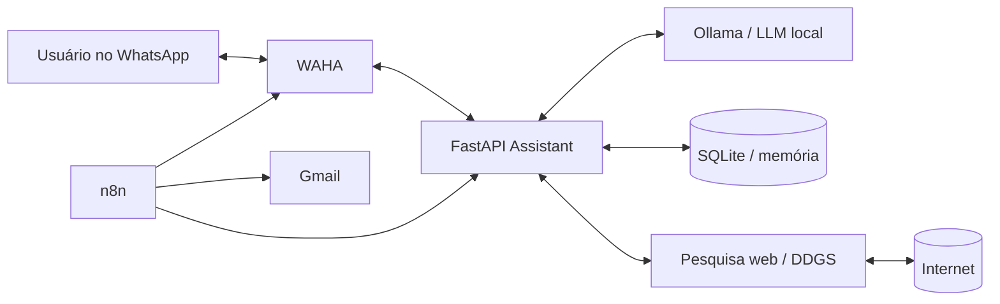

# LeadFlow Local-First

**Assistente de IA no WhatsApp com LLM local, pesquisa na internet, automações n8n, relatórios por Gmail e validação por um segundo agente.**

> **Status: versão 1.0 — projeto funcional e entregável.**

## ▶️ Demo online — experimente sem instalar

**[Abrir a demo interativa do LeadFlow](https://htmlpreview.github.io/?https://github.com/berger33/leadflow-local-first/blob/main/demo/index.html)**

A demo pública permite navegar pela experiência do produto, testar comandos `/web` e `/local`, acompanhar visualmente o pipeline **Roteador → Pesquisa → Agente 1 → Agente 2 → Resposta final** e gerar uma prévia do relatório diário. O fluxo de notícias consulta uma fonte pública de tecnologia em tempo real.

**[⬇ Baixar o projeto completo](https://github.com/berger33/leadflow-local-first/archive/refs/heads/main.zip)** · **[📂 Ver código-fonte](https://github.com/berger33/leadflow-local-first)**

> **Transparência:** a demo não instala Ollama no navegador nem conecta contas pessoais de WhatsApp/Gmail. A versão completa deste repositório executa as duas chamadas reais à LLM local, WAHA, n8n, Gmail e memória SQLite via Docker Compose.

---

## 🎯 Problema que o projeto resolve

O LeadFlow foi desenhado para quem quer um assistente pessoal de IA capaz de:

- responder perguntas pelo WhatsApp;
- manter a inferência principal no próprio computador;
- pesquisar informações atuais na internet quando necessário;
- revisar cada resposta com um segundo agente;
- automatizar pesquisas recorrentes com n8n;
- gerar relatórios estruturados;
- enviar relatórios por Gmail;
- opcionalmente enviar um resumo pelo próprio WhatsApp;
- manter memória curta das conversas localmente.

## 🧠 Diferencial: dois agentes

```text
Pergunta
   ↓
Agente 1 — Respondente
   ↓
Resposta preliminar
   ↓
Agente 2 — Validador
   ├─ entendeu a pergunta?
   ├─ respondeu tudo que foi pedido?
   ├─ há afirmações sem suporte?
   └─ as fontes foram usadas corretamente?
   ↓
Resposta aprovada ou corrigida
```

O Agente 2 recebe a **pergunta original, a resposta preliminar e as fontes web**. Ele devolve score, problemas encontrados e, quando necessário, uma versão corrigida antes do envio ao usuário.

## 🏗️ Arquitetura



| Serviço | Responsabilidade | Porta local |
| --- | --- | ---: |
| LeadFlow Assistant | API, pesquisa, memória, Agente 1 e Agente 2 | `8000` |
| Ollama | LLM local | `11434` |
| WAHA | WhatsApp via HTTP/Webhook | `3000` |
| n8n | agenda, automações e Gmail | `5678` |

As portas ficam presas a `127.0.0.1`, e os containers se comunicam pela rede privada do Docker. O Compose fixa as versões de infraestrutura da entrega para aumentar a reprodutibilidade.

Mais detalhes: [`docs/ARQUITETURA.md`](docs/ARQUITETURA.md).

---

# 🚀 Instalação rápida no Windows

## Requisitos mínimos

- Windows 10/11 64-bit;
- Docker Desktop instalado e aberto;
- 8 GB RAM mínimo; 16 GB recomendado;
- cerca de 8 GB livres em disco;
- internet na primeira instalação e nas pesquisas;
- WhatsApp para parear;
- Gmail apenas se quiser receber relatórios por e-mail.

Veja [`docs/REQUISITOS.md`](docs/REQUISITOS.md).

## 1. Baixe

Use **Code → Download ZIP** ou:

```bash
git clone https://github.com/berger33/leadflow-local-first.git
cd leadflow-local-first
```

## 2. Execute

Dê duplo clique em:

```text
INICIAR_WINDOWS.bat
```

O script verifica o Docker, cria `.env`, gera segredos locais, valida o Compose, constrói a API, inicia o Ollama, baixa o modelo e só libera WAHA/n8n quando os serviços anteriores estão saudáveis.

### Linux/macOS

```bash
chmod +x start.sh
./start.sh
```

---

# 🔐 Primeira configuração

Duas autorizações não podem vir prontas em um repositório público porque pertencem ao usuário.

## WhatsApp

Abra `http://localhost:3000/dashboard`, use as credenciais do seu `.env`, crie/inicie a sessão `default` e escaneie o QR Code. O webhook para o LeadFlow já está definido no Compose.

## n8n

Abra `http://localhost:5678`, crie o administrador local e execute:

```text
IMPORTAR_WORKFLOWS_WINDOWS.bat
```

Workflows incluídos:

| Workflow | Função |
| --- | --- |
| `daily-technology-news.json` | pesquisa diária → dual-agent → relatório HTML → Gmail |
| `research-on-demand.json` | pesquisa sob demanda por webhook n8n |
| `daily-whatsapp-summary.json` | resumo diário opcional pelo WhatsApp |

## Gmail

No workflow diário, conecte sua própria credencial Gmail OAuth2 ao node **Enviar relatório pelo Gmail**. Nenhum token Google é versionado.

Instruções: [`docs/GMAIL_N8N.md`](docs/GMAIL_N8N.md).

---

# 💬 Uso pelo WhatsApp

Perguntas com sinais de atualidade como **hoje**, **agora**, **notícias**, **preço**, **cotação**, **resultado** ou **pesquise** acionam busca web automaticamente.

### Forçar internet

```text
/web quais são as notícias mais importantes de IA hoje?
```

### Forçar somente a LLM local

```text
/local explique recursão em Python
```

O prefixo é removido antes de a pergunta chegar ao modelo/buscador.

---

# 🔎 Pesquisa e relatório diário

O endpoint `POST /research` aceita consultas estruturadas:

```json
{
  "query": "10 notícias mais relevantes de inteligência artificial e tecnologia nas últimas 24 horas",
  "limit": 10,
  "kind": "news",
  "timelimit": "d",
  "language": "pt-BR"
}
```

O retorno contém relatório em texto, HTML pronto para e-mail, resumo para WhatsApp, fontes, validação do segundo agente e horário de geração.

O fluxo diário do n8n agenda essa pesquisa, chama a API, recebe o relatório já revisado e envia por Gmail.

---

# 🌐 Como o acesso à internet funciona

A LLM continua local. Ela não navega sozinha.

1. o LeadFlow detecta necessidade de atualização ou recebe `/web`;
2. DDGS recupera resultados públicos;
3. títulos, snippets e URLs entram como contexto do Agente 1;
4. a resposta atual deve citar as fontes;
5. pergunta + resposta + fontes são enviadas ao Agente 2;
6. somente depois a resposta final é entregue.

Isso separa **inferência local** de **recuperação externa**.

---

# 🧾 Memória local

Uma janela curta de mensagens fica em SQLite no volume `assistant_data`.

```env
MEMORY_TURNS=8
```

Assim perguntas de continuação preservam contexto mesmo após reiniciar containers.

---

# ⚙️ Personalização

```env
OLLAMA_MODEL=qwen3:4b
OLLAMA_VALIDATOR_MODEL=qwen3:4b
GMAIL_REPORT_TO=seu-email@gmail.com
DAILY_NEWS_QUERY=inteligência artificial, tecnologia, software, cibersegurança e inovação
DAILY_NEWS_CRON=0 8 * * *
WHATSAPP_ALLOWED_CHAT_IDS=
```

Uma allowlist pode restringir quais chats usam o bot.

---

# 🛡️ Segurança e privacidade

- `.env` ignorado pelo Git;
- nenhum token Gmail versionado;
- WAHA protegido por API key;
- dashboard WAHA com senha;
- chave de criptografia persistente no n8n;
- grupos ignorados por padrão;
- allowlist opcional de chats;
- memória em SQLite local;
- prompts e LLM executados localmente;
- portas publicadas apenas em `127.0.0.1`;
- resposta revisada por um segundo agente.

A WAHA automatiza WhatsApp Web e não é a API oficial WhatsApp Business. Use de forma responsável.

Leia [`SECURITY.md`](SECURITY.md).

---

# 🧪 Testes e CI

A validação da versão 1.0 registra:

```text
10 passed
```

Cobertura:

- roteamento automático web/local;
- `/web` e `/local`;
- chamada independente do segundo agente;
- respostas com fontes;
- relatório pronto para Gmail;
- parsing de webhook WAHA;
- persistência da memória SQLite.

```bash
pip install -r requirements-dev.txt
python -m pytest -q
```

O GitHub Actions também valida os JSON dos workflows e `docker compose config`.

Detalhes: [`docs/VALIDACAO.md`](docs/VALIDACAO.md).

---

# 🩺 Diagnóstico

No Windows:

```text
DIAGNOSTICO_WINDOWS.bat
```

Ou:

```bash
docker compose ps
docker compose logs --tail=100 assistant
docker compose logs --tail=100 waha
docker compose logs --tail=100 n8n
docker compose logs --tail=100 ollama-init
```

Guia: [`docs/TROUBLESHOOTING.md`](docs/TROUBLESHOOTING.md).

---

# 📁 Estrutura

```text
leadflow-local-first/
├── app/
│   ├── agents.py
│   ├── config.py
│   ├── main.py
│   ├── memory.py
│   ├── ollama_client.py
│   ├── schemas.py
│   ├── search.py
│   └── waha.py
├── demo/
│   └── index.html
├── n8n/workflows/
├── tests/
├── docs/
├── scripts/
├── Dockerfile
├── docker-compose.yml
├── .env.example
├── INICIAR_WINDOWS.bat
├── IMPORTAR_WORKFLOWS_WINDOWS.bat
├── DIAGNOSTICO_WINDOWS.bat
├── SECURITY.md
├── CHANGELOG.md
└── LICENSE
```

## Tecnologias

`Python` · `FastAPI` · `Ollama` · `n8n` · `WAHA` · `Docker Compose` · `SQLite` · `DDGS` · `HTTPX` · `Gmail` · `Pytest` · `GitHub Actions` · `HTML/CSS/JavaScript`

## Decisões de engenharia

- **FastAPI entre n8n, WAHA e Ollama:** mantém regra de negócio testável fora do n8n.
- **Duas chamadas de LLM:** o segundo prompt tem papel crítico independente do primeiro.
- **SQLite:** memória simples, local e portátil.
- **Docker Compose:** reduz diferenças entre ambientes de instalação.
- **Versões fixadas:** evita que atualizações de infraestrutura quebrem silenciosamente a entrega.

## Limitações conhecidas

- resultados web dependem de serviços públicos;
- modelos locais podem ser lentos em CPU;
- o segundo agente reduz erros, mas não garante factualidade perfeita;
- Gmail exige autorização do usuário;
- WAHA depende do comportamento do WhatsApp Web;
- a versão 1.0 é para uso pessoal/local, não para SaaS multiusuário exposto diretamente à internet.

---

**William de Melo Berger — portfólio de desenvolvimento, automação e Inteligência Artificial aplicada.**