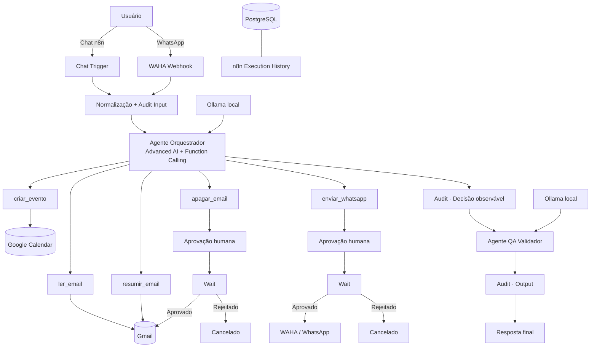

# Sistema Agêntico n8n WhatsApp+Email

**Automação agêntica local-first com n8n, LLM local, Function Calling, Gmail, Google Calendar, WhatsApp, Human-in-the-loop e um segundo agente de QA.**

[](https://github.com/berger33/leadflow-local-first/actions/workflows/ci.yml)

> Evolução do LeadFlow para um sistema centrado em orquestração agêntica, segurança operacional, QA e uma experiência de instalação orientada a produto.

<p align="center">
  <strong>🤖 Agente Executor</strong> · <strong>🧪 Agente QA</strong> · <strong>🛡️ Human-in-the-loop</strong> · <strong>📧 Gmail</strong> · <strong>💬 WhatsApp</strong> · <strong>📅 Calendar</strong>
</p>

## Acesso rápido

**[▶ Abrir demo interativa](https://htmlpreview.github.io/?https://github.com/berger33/leadflow-local-first/blob/main/demo/index.html)** · **[⬇ Baixar projeto](https://github.com/berger33/leadflow-local-first/archive/refs/heads/main.zip)** · **[🧠 Ver workflow](n8n-agent-workflow.json)**

A demo pública apresenta Function Calling, dual-agent, aprovação humana e audit trail sem exigir contas pessoais. A versão completa roda localmente via Docker.

---

# Instalação visual no Windows

A experiência recomendada foi desenhada para que um novo usuário **não precise editar `.env`, criar chaves internas nem importar o workflow manualmente**.

## Requisitos

- Windows 10/11 64-bit;
- Docker Desktop com Docker Compose v2;
- 8 GB RAM mínimo; 16 GB recomendado;
- aproximadamente 10 GB livres;
- internet na primeira instalação.

Não é necessário instalar manualmente Python, Node.js, PostgreSQL, n8n, Ollama ou WAHA.

## Primeira execução

1. Baixe o ZIP do projeto.
2. Extraia a pasta.
3. Abra o Docker Desktop e aguarde o Engine ficar pronto.
4. Execute:

```text
INSTALAR_WINDOWS.bat
```

Também é possível executar `INICIAR_WINDOWS.bat`: se ainda não existir uma instalação concluída, ele redireciona automaticamente para o assistente visual.

## Interface de instalação

O navegador abre localmente em:

```text
http://127.0.0.1:8765
```

A interface oficial é servida por:

```text
setup/app.html
scripts/setup-wizard-v2.ps1
```

O fluxo visual possui quatro etapas:

```text
Preferências
    ↓
Instalação
    ↓
Conexões
    ↓
Pronto
```

A interface foi revisada para uso em desktop e notebook, incluindo 1366×768, e possui:

- grade responsiva sem sobreposição de campos;
- painel lateral de progresso;
- formulários com largura previsível;
- campos de senha com mostrar/ocultar;
- botões de copiar;
- indicadores de saúde dos serviços;
- barra de progresso;
- console técnico para diagnóstico;
- estados de sucesso e erro;
- layout adaptativo para telas menores.

### Compatibilidade UTF-8 no Windows

O servidor do instalador utiliza **leitura e escrita UTF-8 explícitas**. Isso evita o problema clássico do Windows PowerShell 5.1 em que textos UTF-8 sem BOM podem ser interpretados com a página de código ANSI e aparecer como:

```text
Configuração
Preferências
Conexões
```

A versão atual lê `app.html` e `.env` explicitamente com `System.Text.Encoding.UTF8` e também responde ao navegador com `charset=utf-8`.

---

# O que o usuário informa

Na primeira tela são solicitados somente dados que pertencem ao próprio usuário:

- nome e sobrenome;
- e-mail de login local do n8n;
- senha local do n8n;
- e-mail para aprovações Human-in-the-loop, opcional;
- modelo Ollama principal;
- modelo do Agente QA;
- fuso horário;
- Google OAuth Client ID, opcional;
- Google OAuth Client Secret, opcional.

A senha local do n8n é mantida apenas em memória durante a criação do proprietário e **não é persistida no `.env`**.

A tela também informa a URI OAuth local:

```text
http://localhost:5678/rest/oauth2-credential/callback
```

---

# O que é automático

Depois de clicar em **Instalar e configurar automaticamente**, o instalador executa:

```text
verifica Docker
      ↓
cria/repara .env
      ↓
gera segredos internos aleatórios
      ↓
valida Docker Compose
      ↓
remove conflitos legados sem apagar volumes
      ↓
inicia PostgreSQL + Ollama
      ↓
executa health checks
      ↓
verifica o modelo local
      ↓
baixa o modelo ausente com retry
      ↓
inicia n8n + WAHA
      ↓
cria o primeiro proprietário local do n8n
      ↓
cria a credencial Ollama
      ↓
prepara Gmail/Calendar se Google OAuth foi informado
      ↓
gera o workflow com referências de credencial
      ↓
importa e verifica o workflow
      ↓
remove arquivos temporários
      ↓
marca a instalação como concluída
```

Depois da primeira instalação é criado localmente:

```text
.setup-complete
```

Nas execuções seguintes, `INICIAR_WINDOWS.bat` apenas sobe o stack existente.

---

# Credenciais e consentimentos

| Componente | Configuração técnica | Ação do usuário |
| --- | --- | --- |
| PostgreSQL | automática | nenhuma |
| Chave de criptografia n8n | automática | nenhuma |
| Proprietário local n8n | criado pelo wizard | informar nome, e-mail e senha |
| Ollama | automático | nenhuma API paga |
| Download do modelo | automático | aguardar |
| Credencial Ollama no n8n | automática | nenhuma |
| WAHA API key | automática | nenhuma |
| WAHA dashboard | usuário/senha gerados | usar para entrar |
| Gmail/Calendar | preparados se Client ID/Secret forem informados | consentir OAuth no Google |
| WhatsApp | infraestrutura automática | escanear QR Code |

A filosofia é: **automatizar configuração técnica; nunca automatizar consentimento de identidade**.

---

# Arquitetura agêntica



---

# Function Calling

O arquivo [`n8n-agent-workflow.json`](n8n-agent-workflow.json) contém o workflow principal.

## `ler_email(query, limit)`

Consulta mensagens do Gmail sem alterar conteúdo.

## `resumir_email(id)`

Recupera uma mensagem real pelo ID para produção de resumo estruturado.

## `apagar_email(id)`

Ferramenta destrutiva protegida por aprovação humana:

```text
Tool Call
  ↓
Audit
  ↓
Pedido de aprovação
  ↓
Wait
  ├── aprovado → Gmail Delete
  └── rejeitado → cancelamento
```

## `enviar_whatsapp(contato, msg)`

Ação de comunicação externa. Também exige aprovação humana antes do envio pelo WAHA.

## `criar_evento(data, titulo)`

Cria evento no Google Calendar quando data/hora e título estão claros.

---

# Dois agentes

## Agente Executor

Responsável por interpretar a intenção, selecionar ferramentas, preencher parâmetros via Function Calling, consumir resultados e produzir uma resposta preliminar.

## Agente QA Validador

Não possui acesso às ferramentas destrutivas. Recebe pedido original, resposta preliminar e evidências observáveis da execução para verificar:

- aderência ao pedido;
- clareza;
- consistência com resultados das ferramentas;
- ausência de sucesso inventado;
- respeito ao Human-in-the-loop.

A regra arquitetural é: **quem executa não é o mesmo componente que valida**.

---

# Segurança e privacidade

- interfaces administrativas vinculadas a `127.0.0.1`;
- `.env` ignorado pelo Git;
- senha do proprietário n8n mantida apenas em memória durante o setup;
- arquivos temporários de credenciais ignorados e apagados após importação;
- segredos internos gerados localmente;
- tokens OAuth não são versionados;
- sessão do WhatsApp permanece local;
- ações críticas possuem `Wait` + aprovação humana;
- audit trail registra eventos, parâmetros, resultados e outputs observáveis;
- raw chain-of-thought não é persistido;
- setup UI escuta somente em `127.0.0.1`;
- conteúdo HTML é servido explicitamente em UTF-8.

Consulte [`SECURITY.md`](SECURITY.md).

---

# Qualidade e CI

O GitHub Actions valida:

- JSON e contrato do workflow;
- dois agentes e cinco tools;
- dois gates Human-in-the-loop;
- HTML UTF-8 do instalador;
- ausência de mojibake conhecido no arquivo-fonte;
- IDs/endpoints necessários para a UI;
- responsividade mínima do layout;
- sintaxe do `bootstrap.ps1`;
- sintaxe do `setup-wizard-v2.ps1`;
- presença de leitura UTF-8 explícita;
- configuração do launcher Windows;
- Docker Compose;
- binds locais das portas;
- ausência do antigo `ollama-init`;
- padrões comuns de vazamento de segredos.

O smoke test Docker sobe PostgreSQL, Ollama, n8n e WAHA e executa um `ollama pull` real de um modelo pequeno antes de validar a finalização do workflow.

---

# Diagnóstico

Em caso de falha:

```text
DIAGNOSTICO_WINDOWS.bat
```

O script verifica Docker, Compose, containers, endpoints e logs dos serviços.

---

# Estrutura principal

```text
leadflow-local-first/
├── .github/workflows/ci.yml
├── demo/
│   └── index.html
├── setup/
│   └── app.html
├── scripts/
│   ├── bootstrap.ps1
│   └── setup-wizard-v2.ps1
├── .env.example
├── docker-compose.yml
├── n8n-agent-workflow.json
├── INSTALAR_WINDOWS.bat
├── INICIAR_WINDOWS.bat
├── DIAGNOSTICO_WINDOWS.bat
├── SECURITY.md
├── CHANGELOG.md
└── README.md
```

---

# Tecnologias

`n8n Advanced AI` · `Function Calling` · `Ollama` · `Qwen3` · `WAHA` · `WhatsApp` · `Gmail` · `Google Calendar` · `PostgreSQL` · `Docker Compose` · `PowerShell` · `HTML5` · `CSS3` · `JavaScript` · `Human-in-the-loop` · `GitHub Actions` · `QA` · `Audit Trail`

---

## Status

**Versão 2.2.1 — Guided Setup / UTF-8 Windows Fix**

A versão atual substitui o instalador visual anterior por uma única implementação oficial, com leitura UTF-8 explícita, layout revisado para desktop/notebook e CI dedicado a prevenir regressões de codificação no Windows.

## Autor

**William de Melo Berger** — projetos em Inteligência Artificial aplicada, automação, backend e Engenharia de Software.
