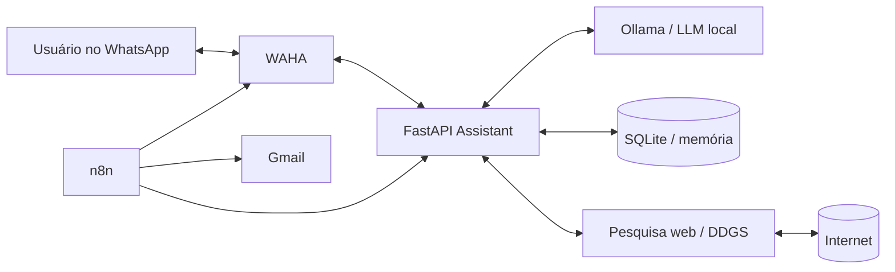

# LeadFlow Local-First

**Assistente de IA no WhatsApp com LLM local, pesquisa na internet, automações n8n, relatórios por Gmail e validação por um segundo agente.**

> **Status: versão 1.0 — projeto funcional e entregável.**
>
> O objetivo é permitir que uma pessoa rode um assistente no próprio computador, converse com ele pelo WhatsApp e automatize pesquisas recorrentes sem depender de uma API paga de LLM.

## O problema que este projeto resolve

Assistentes de IA normalmente exigem uma combinação de serviços SaaS, APIs pagas e dados enviados para terceiros. O LeadFlow usa uma arquitetura **local-first**: a inferência principal acontece no computador do usuário, mas o sistema continua capaz de consultar informações atuais na internet e executar automações programadas.

Exemplos de uso:

- perguntar qualquer coisa pelo WhatsApp e receber a resposta da LLM local;
- perguntar **“quais foram as principais notícias de IA hoje?”** e receber uma resposta baseada em pesquisa web;
- executar todo dia uma pesquisa sobre as **10 notícias mais quentes em tecnologia**;
- gerar um relatório estruturado, revisado por um segundo agente;
- enviar o relatório automaticamente para um Gmail pelo n8n;
- opcionalmente enviar um resumo diário também pelo WhatsApp;
- manter memória curta das conversas mesmo após reiniciar os containers.

---

## Diferencial: arquitetura com dois agentes

O sistema não envia a primeira resposta diretamente ao usuário.

```text
Pergunta
   |
   v
Agente 1 — Respondente
   |
   | resposta preliminar
   v
Agente 2 — Validador
   |
   +-- entendeu exatamente a pergunta?
   +-- respondeu tudo que foi pedido?
   +-- há afirmações sem suporte?
   +-- usou corretamente as fontes atuais?
   |
   v
Resposta aprovada ou corrigida
```

O **Agente 2** recebe a pergunta original, a resposta do primeiro agente e as fontes web utilizadas. Ele devolve um score, problemas encontrados e, quando necessário, uma versão corrigida.

Isso não elimina erros de LLM, mas cria uma camada explícita de controle de qualidade antes da resposta final.

---

## Arquitetura



| Serviço | Responsabilidade | Porta local |
| --- | --- | ---: |
| **LeadFlow Assistant** | API, pesquisa, memória, Agente 1 e Agente 2 | `8000` |
| **Ollama** | execução local da LLM | `11434` |
| **WAHA** | conexão HTTP/Webhook com WhatsApp | `3000` |
| **n8n** | agenda, automação, Gmail e integrações | `5678` |

As portas são vinculadas a **`127.0.0.1`**, não a todas as interfaces da máquina. A comunicação entre containers ocorre pela rede privada do Docker.

Para tornar a entrega reproduzível, o Compose fixa as versões de infraestrutura usadas pela versão 1.0: **Ollama 0.32.6**, **WAHA `latest-2026.7.2`** e **n8n 2.33.5**.

Arquitetura detalhada: [`docs/ARQUITETURA.md`](docs/ARQUITETURA.md).

---

# Instalação rápida no Windows

## Requisitos mínimos

- Windows 10 ou 11 64-bit;
- **Docker Desktop** instalado e aberto;
- **8 GB de RAM** no mínimo; 16 GB recomendado;
- aproximadamente **8 GB livres** em disco;
- internet na primeira instalação e nas pesquisas;
- um WhatsApp para parear;
- Gmail somente se quiser receber os relatórios por e-mail.

Veja [`docs/REQUISITOS.md`](docs/REQUISITOS.md).

## 1. Baixe o projeto

No GitHub, clique em **Code → Download ZIP**, extraia a pasta e abra-a.

Ou use Git:

```bash
git clone https://github.com/berger33/leadflow-local-first.git
cd leadflow-local-first
```

## 2. Execute

No Windows, dê duplo clique em:

```text
INICIAR_WINDOWS.bat
```

O script:

1. verifica se o Docker está instalado e ativo;
2. cria `.env` automaticamente se necessário;
3. gera segredos locais aleatórios em UTF-8 sem BOM;
4. valida a configuração do Docker Compose;
5. constrói o serviço Python;
6. inicia Ollama e baixa o modelo local configurado;
7. só inicia o Assistente depois que o modelo estiver disponível;
8. só inicia WAHA e n8n depois que a API estiver saudável;
9. abre os painéis necessários.

Na primeira execução, o download do modelo pode levar alguns minutos.

### Linux/macOS

```bash
chmod +x start.sh
./start.sh
```

---

# Primeira configuração

São necessárias apenas duas configurações externas porque pertencem às contas do próprio usuário: **parear o WhatsApp** e, se desejado, **autorizar o Gmail**.

## 1. WhatsApp

Abra:

```text
http://localhost:3000/dashboard
```

As credenciais do dashboard e a API key ficam no seu arquivo `.env`.

No painel:

1. conecte o dashboard à API usando `WAHA_API_KEY`;
2. crie/inicie a sessão `default`;
3. escaneie o QR Code pelo aplicativo do WhatsApp;
4. aguarde a sessão ficar operacional.

O webhook já vem configurado no `docker-compose.yml`. Depois do pareamento, mensagens privadas recebidas nessa conta são encaminhadas automaticamente ao LeadFlow.

> Por padrão grupos são ignorados. Você pode alterar `WHATSAPP_REPLY_GROUPS` no `.env`.

## 2. n8n

Abra:

```text
http://localhost:5678
```

Na primeira execução, crie o administrador local do n8n.

Depois execute:

```text
IMPORTAR_WORKFLOWS_WINDOWS.bat
```

ou importe manualmente os JSON da pasta [`n8n/workflows`](n8n/workflows).

### Workflows fornecidos

| Workflow | Função |
| --- | --- |
| `daily-technology-news.json` | pesquisa diária → dual-agent → relatório HTML → Gmail |
| `research-on-demand.json` | pesquisa sob demanda exposta por webhook n8n |
| `daily-whatsapp-summary.json` | resumo diário opcional enviado ao WhatsApp |

## 3. Gmail

O projeto não versiona credenciais Google.

No workflow **LeadFlow - Relatório diário de tecnologia**, abra o node **Enviar relatório pelo Gmail** e conecte sua credencial Gmail uma única vez.

O node é entregue explicitamente como `resource=message`, `operation=send` e `emailType=html`, deixando apenas a credencial pessoal para configuração.

Instruções: [`docs/GMAIL_N8N.md`](docs/GMAIL_N8N.md).

---

# Usando pelo WhatsApp

Depois de parear a sessão, basta mandar mensagens para o WhatsApp conectado.

### Detecção automática

Perguntas contendo sinais de atualidade como **hoje**, **agora**, **notícias**, **preço**, **cotação**, **resultado**, **pesquise** ou equivalentes acionam a pesquisa web automaticamente.

### Forçar internet

```text
/web qual é a cotação do dólar agora?
```

O prefixo é removido antes da busca. O Assistente obrigatoriamente tenta obter contexto da internet e o Agente Validador recebe as fontes encontradas.

### Forçar somente a LLM local

```text
/local explique recursão em Python
```

Nesse caso nenhuma pesquisa web é feita, mesmo que a frase contenha termos que normalmente ativariam a internet.

---

# Testando pela API

Abra:

```text
http://localhost:8000/docs
```

Use `POST /chat`:

```json
{
  "message": "Explique o que é RAG de maneira simples",
  "chat_id": "teste",
  "use_web": false
}
```

Pergunta atual que aciona pesquisa automaticamente:

```json
{
  "message": "Quais são as notícias mais importantes de inteligência artificial de hoje?",
  "chat_id": "teste"
}
```

Também há scripts PowerShell:

```powershell
.\scripts\test-chat.ps1
.\scripts\test-research.ps1
```

## Pesquisa completa

`POST /research`:

```json
{
  "query": "10 notícias mais relevantes de inteligência artificial e tecnologia nas últimas 24 horas",
  "limit": 10,
  "kind": "news",
  "timelimit": "d",
  "language": "pt-BR"
}
```

A resposta contém relatório em texto, HTML pronto para e-mail, resumo para WhatsApp, fontes, resultado do segundo agente e horário de geração.

---

# Como o acesso à internet funciona

A **LLM continua local**. Ela não navega sozinha.

Quando uma pergunta depende de informação recente, o LeadFlow:

1. identifica a necessidade de pesquisa ou recebe o comando `/web`;
2. usa DDGS para consultar metabuscadores públicos;
3. fornece títulos, snippets e URLs ao Agente 1;
4. exige que a resposta atual cite essas fontes;
5. envia pergunta + resposta + fontes ao Agente 2;
6. só então entrega o resultado.

Isso separa **inferência local** de **recuperação de informação externa**.

---

# Memória de conversa

O Assistente grava uma janela curta de mensagens em SQLite no volume Docker `assistant_data`.

Assim, perguntas de continuação podem usar o contexto de turnos anteriores sem serviço de banco externo.

```env
MEMORY_TURNS=8
```

---

# Personalização

As configurações principais ficam em `.env`:

```env
OLLAMA_MODEL=qwen3:4b
OLLAMA_VALIDATOR_MODEL=qwen3:4b
GMAIL_REPORT_TO=seu-email@gmail.com
DAILY_NEWS_QUERY=inteligência artificial, tecnologia, software, cibersegurança e inovação
DAILY_NEWS_CRON=0 8 * * *
```

### Restringir quem pode usar o bot

```env
WHATSAPP_ALLOWED_CHAT_IDS=5511999999999@c.us
```

Se ficar vazio, qualquer conversa privada recebida pela conta conectada poderá usar o assistente.

---

# Segurança e privacidade

- `.env` está no `.gitignore`;
- nenhum token Gmail é versionado;
- WAHA exige API key;
- dashboard WAHA usa senha própria;
- n8n usa chave de criptografia persistente;
- grupos são ignorados por padrão;
- existe allowlist opcional de chats;
- a memória fica em SQLite local;
- LLM e prompts rodam localmente no Ollama;
- um segundo agente revisa a resposta antes do envio;
- todas as portas publicadas ficam presas a `127.0.0.1`;
- os serviços foram desenhados para uso local/rede Docker confiável.

A WAHA usa automação sobre WhatsApp Web; esse tipo de integração não é a API oficial WhatsApp Business e pode ter riscos de bloqueio. Use de forma responsável.

Leia também [`SECURITY.md`](SECURITY.md).

---

# Diagnóstico

No Windows:

```text
DIAGNOSTICO_WINDOWS.bat
```

Ou:

```bash
docker compose ps
docker compose logs --tail=100 assistant
docker compose logs --tail=100 waha
docker compose logs --tail=100 n8n
docker compose logs --tail=100 ollama-init
```

Guia: [`docs/TROUBLESHOOTING.md`](docs/TROUBLESHOOTING.md).

---

# Testes e CI

A validação local da lógica da versão final resultou em:

```text
10 passed
```

Os testes cobrem:

- detecção automática de pergunta que necessita web;
- comandos `/web` e `/local`;
- chamada independente do segundo agente;
- resposta com fontes;
- geração de relatório pronto para Gmail;
- parsing de webhook WAHA;
- persistência da memória local.

```bash
python -m venv .venv
# Windows: .venv\Scripts\activate
# Linux/macOS: source .venv/bin/activate
pip install -r requirements-dev.txt
python -m pytest -q
```

O GitHub Actions valida testes, JSON dos workflows e sintaxe do Docker Compose a cada push.

Escopo de validação e checklist para uma instalação nova: [`docs/VALIDACAO.md`](docs/VALIDACAO.md).

---

# Estrutura do repositório

```text
leadflow-local-first/
├── app/
│   ├── agents.py             # Agente 1 + Agente 2 + roteamento web/local
│   ├── config.py             # configuração por ambiente
│   ├── main.py               # FastAPI / endpoints / webhook WAHA
│   ├── memory.py             # memória SQLite
│   ├── ollama_client.py      # cliente da LLM local
│   ├── schemas.py            # contratos da API
│   ├── search.py             # pesquisa na internet
│   └── waha.py               # integração WhatsApp
├── n8n/workflows/
│   ├── daily-technology-news.json
│   ├── daily-whatsapp-summary.json
│   └── research-on-demand.json
├── tests/
├── docs/
├── scripts/
├── Dockerfile
├── docker-compose.yml
├── .env.example
├── INICIAR_WINDOWS.bat
├── IMPORTAR_WORKFLOWS_WINDOWS.bat
├── DIAGNOSTICO_WINDOWS.bat
├── SECURITY.md
├── CHANGELOG.md
└── LICENSE
```

---

# Decisões de engenharia

### Por que FastAPI entre n8n, WAHA e Ollama?

Para que n8n seja responsável por **orquestração**, não pela regra de negócio inteira. O código Python pode ser testado, versionado e usado também fora do n8n.

### Por que duas chamadas de LLM?

A segunda chamada usa um prompt e objetivo diferentes: ela não continua a conversa; ela **critica a resposta anterior** e corrige desvios.

### Por que SQLite?

É suficiente para memória local de um assistente pessoal, não exige infraestrutura adicional e mantém o projeto portátil.

### Por que Docker Compose?

Reduz a diferença entre “funciona no meu PC” e “funciona no computador de quem clonou”. O host precisa essencialmente de Docker, não de Python, Node, n8n e Ollama instalados manualmente.

### Por que versões fixadas?

Porque um portfólio entregável deve ser reproduzível. Atualizações de infraestrutura passam a ser uma decisão explícita, em vez de acontecerem silenciosamente a cada `docker pull`.

---

# Limitações conhecidas

- resultados de busca dependem de serviços públicos e podem sofrer rate limit;
- LLMs locais podem responder mais lentamente em CPU;
- o segundo agente reduz erros, mas não garante factualidade perfeita;
- Gmail exige autorização da conta do usuário;
- WAHA depende do comportamento do WhatsApp Web;
- a versão 1.0 foi pensada para **uso pessoal/local**, não como SaaS multiusuário exposto publicamente.

---

## Documentação da versão

- [Arquitetura](docs/ARQUITETURA.md)
- [Requisitos](docs/REQUISITOS.md)
- [Configuração Gmail/n8n](docs/GMAIL_N8N.md)
- [Validação](docs/VALIDACAO.md)
- [Troubleshooting](docs/TROUBLESHOOTING.md)
- [Segurança](SECURITY.md)
- [Changelog](CHANGELOG.md)
- [Licença MIT](LICENSE)

## Tecnologias

`Python` · `FastAPI` · `Ollama` · `n8n` · `WAHA` · `Docker Compose` · `SQLite` · `DDGS` · `HTTPX` · `Gmail` · `Pytest` · `GitHub Actions`

## Autor

**William de Melo Berger** — portfólio de desenvolvimento, automação e Inteligência Artificial aplicada.
